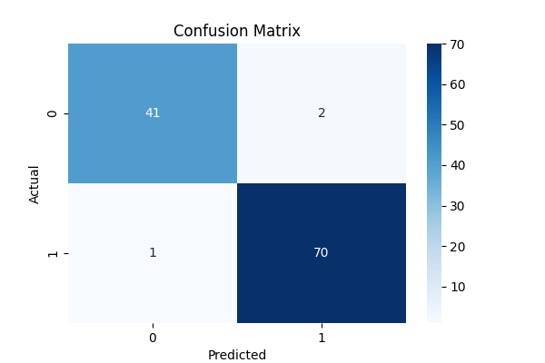

# SVM-Classification-ML-Project
End-to-end SVM classification project with preprocessing, tuning, and evaluation

# Support Vector Machine (SVM) Classification Project

## 📌 Overview
This project demonstrates an end-to-end machine learning pipeline using Support Vector Machines (SVM) for classification.

## 🚀 Features
- Data preprocessing & feature scaling
- SVM with RBF kernel
- Hyperparameter tuning using GridSearchCV
- Detailed evaluation metrics
- Reproducible Google Colab notebook

## 📊 Results

## 🛠️ Tech Stack
- Python
- Scikit-learn
- Pandas
- Matplotlib
- Seaborn

## 📁 Project Structure

